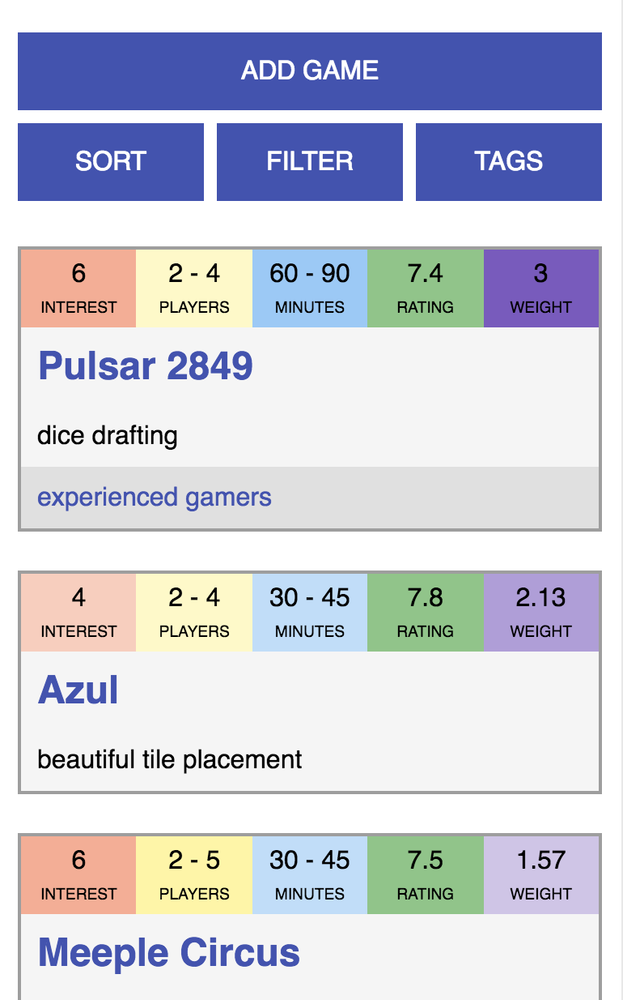
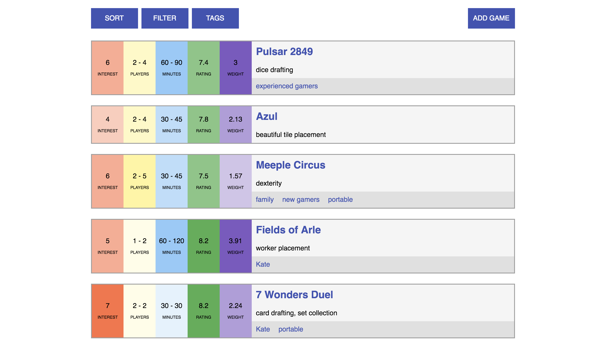

#Want-to-Play

##LINKS
[Deployed site](http://want-to-play.surge.sh/)
[Frontend repo](https://github.com/TalusRocks/want-to-play-fe)

[Heroku app](https://want-to-play.herokuapp.com/games)
[Backend repo](https://github.com/TalusRocks/want-to-play)

##ABOUT
I love playing board games, and especially love learning NEW board games. There are so many that I want to try, that I started keeping a list, which then eventually got so long, I made a sortable Google Sheet out of it.

However, I found that I most often wanted to refer to my Sheet when I was out and about, at a board game shop, café, or group, where there was a large collection to try something from– and my Sheet wasn't sortable on mobile, and generally hard to navigate and use.

So I made Want-to-Play, as a mobile-friendly tool for keeping a list of games that is sortable and filterable by a variety of attributes.

##USER STORIES
As a user, I can...
###Done
-Add, edit, and delete games
-Sort by one attribute
-Filter by one or many attributes
###In Progress
-Nest sort (sort by several attributes)
-Combine filter and sort
-Add, edit, and delete unique tags
-Filter by tags

##Next Steps
-Consider integrating BoardGameGeek API to populate game data
-A way to mark a game as 'played' rather than 'deleted', and archive them with notes about the play

##Built With
-HTML5, CSS3
-JavaScript
-Node.js, Express.js, Knex.js
-Postgresql

##INSTALLATION
To run this locally:
1. Clone/download both the [frontend](https://github.com/TalusRocks/want-to-play-fe) and the [backend](https://github.com/TalusRocks/want-to-play) repo.
2. Install packages with command `npm install`
3. Start the backend server with command `node app.js`
4. Start the fronted with command `live-server` or open the `index.html` file in your browser
